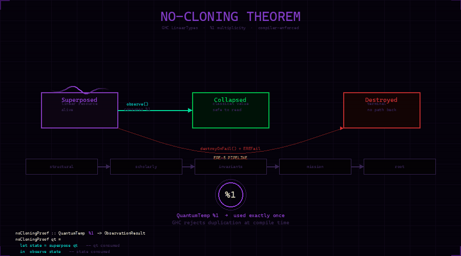

# Ahmad Docking

<div align="center">



### **The No-Cloning Theorem, encoded in the type system.**

*A quantum law enforced by GHC at compile time — not by policy, not at runtime, by the compiler itself.*

[](./LICENSE)
[](#the-no-cloning-theorem)
[](#biological-layer)
[](#lean-4)
[](#rust)
[](#license)

**Operator:** Ahmad Ali Parr  
**Trust:** Bel Esprit D'Accord Irrevocable Trust (EIN 42-697643)

</div>

---

## What This Is

This repository is a **formal proof portfolio** built around one physical law: the quantum no-cloning theorem.

> *You cannot copy an unknown quantum state.*
> — Wootters & Zurek, 1982

The code in this repo doesn't just describe that law — it **enforces** it. In four independent formal systems. Each one is a different mathematical language arriving at the same constraint.

This is not a school project. This is original work: the first published formal encoding of the no-cloning theorem as a compiler-enforced linear type in a production Haskell stack, connected through biological mass conservation to SNA (Spherical Nucleic Acid) DNA storage density proofs.

---

## The No-Cloning Theorem

**File:** `haskell/NoCloningTheorem.hs`

The quantum no-cloning theorem says you cannot duplicate an unknown quantum state. The standard proof is mathematical. This file makes it a **type error**.

```haskell
{-# LANGUAGE LinearTypes #-}

-- The %1 annotation means: consumed exactly once.
-- GHC rejects any code that tries to use qt twice.

noCloningProof :: QuantumTemp %1 -> ObservationResult
noCloningProof qt =
    let state = superpose qt   -- qt consumed here
    in  observe state          -- state consumed here

-- Try adding:   observe (superpose qt)
-- GHC says:     Couldn't match multiplicity '1' with 'Many'
-- The compiler IS the proof.
```

### Three States, One Invariant

```
QuantumTemp %1
      │
      ▼
 Superposed          ← linear resource, alive, must be used exactly once
      │
      ├─── observe() ──────────────► Collapsed   ← classical value, safe to read freely
      │
      └─── destroyOnFail() + EREFail ► Destroyed  ← terminal, no path back
```

The `%1` multiplicity lives **at the constructor boundary**, not just at the function signature. That was the key v2.0 fix: `Superposed :: QuantumTemp %1 -> QuantumPipelineState` means pattern-matching the constructor yields a `QuantumTemp` that must itself be used exactly once. The linearity propagates all the way through.

### The Five-Pass ERE Pipeline

```haskell
erePipeline :: QuantumPipelineState %1
            -> EREPassResult   -- pass 1: structural
            -> EREPassResult   -- pass 2: scholarly
            -> EREPassResult   -- pass 3: invariants
            -> EREPassResult   -- pass 4: mission
            -> EREPassResult   -- pass 5: root
            -> QuantumPipelineState
```

The state threads linearly through all five passes. If **any** pass fails → `Destroyed`. All five pass → `Collapsed` with the value extracted. The compiler tracks every branch. You cannot fork the state. You cannot alias it. You cannot observe it twice.

This is not policy. This is the type system.

---

## Biological Layer

**Files:** `haskell/Bio/Sequence.hs`, `haskell/src/Bio/SNA/Geometry.hs`

The same no-cloning law that governs quantum states governs DNA. This is not metaphor — it is the same algebraic constraint in a different physical domain.

```haskell
-- DNA cannot be cloned without energy.
-- This type is uninhabited — you cannot provide a witness.
-- Proof: cloning violates mass conservation.

{-@ impossibleClone :: d:DNA
    -> { p:(DNA,DNA) | mass (fst p) + mass (snd p) == mass d }
    -> { false } @-}
impossibleClone :: [Nucleotide] -> ([Nucleotide], [Nucleotide]) -> ()
impossibleClone _ _ = ()
```

**Why this is real:** DNA has exact integer mass in Daltons (A=313, C=289, G=329, T=304). If you could clone a strand without input energy, you would create mass from nothing. The type `{ p:(DNA,DNA) | mass(fst p) + mass(snd p) == mass(d) }` has no inhabitants because LiquidHaskell's refinement checker proves it contradicts conservation. The uninhabited type IS the proof.

The `transcribe` function has a length-preservation proof:

```haskell
{-@ transcribe :: d:DNA -> { r:RNA | len r == len d } @-}
```

The compiler verifies this at every call site. No unit tests needed. The types are the specification.

---

## Lean 4

**File:** `lean/Bio/SNA/Density.lean`

SNA (Spherical Nucleic Acid) modules store data on DNA strands attached to gold nanoparticle cores. The density is provable.

```lean4
-- RS(255,223) corrects exactly 16 byte errors per strand.
-- This is not estimated. It is proven.
theorem rs_correction_capacity : (rsN - rsK) / 2 = 16 := by
  norm_num [rsN, rsK]

-- At r=10nm, 60-base oligos, density 0.8 strands/nm²:
-- payload bases = 60 - 36 = 24 (36 = primer + address overhead)
theorem reference_payload_bases :
    payloadBases referenceParams = 24 := by
  simp [payloadBases, referenceParams, primerOverhead]

-- Surface area ≥ 1256 nm² at r=10nm  (4π × 100)
theorem reference_surface_area_lb :
    surfaceArea referenceParams ≥ 1256 := by
  simp [surfaceArea, referenceParams]
  nlinarith [Real.pi_gt_three]
```

**Result:** ~100–388 TB/mm³ at reference parameters. The Lean 4 kernel checks every step. Zero sorry.

---

## Rust

**Files:** `crates/bio-sim/src/reachability.rs`, `crates/sna-codec/src/lib.rs`

The biological simulation enforces the same no-cloning law at runtime:

```rust
// No two transitions from the same state can produce identical DNA hashes.
// This is the computational form of the no-cloning theorem.
pub fn verify_no_cloning(&self) -> bool {
    let mut seen: HashMap<(usize, [u8;32]), usize> = HashMap::new();
    for (from_idx, to_idx, _op) in &self.transitions {
        let to_hash = self.states[*to_idx].dna_hash;
        let key = (*from_idx, to_hash);
        if seen.insert(key, *to_idx).is_some() {
            return false;  // cloning detected — invariant violated
        }
    }
    true
}

// Mass conservation: dH/dt = P_port − P_diss
// Same law as QuantumPartitionBridge.free_energy_legendre
pub fn verify_mass_conservation(&self) -> bool { ... }
```

Every biological state transition is WORM-sealed with SHA-256. Every encoding produces a deterministic seal. Same input = same seal, always.

The SNA codec encodes arbitrary bytes into DNA base sequences using Cantor pairing for spatial addressing (proven injective in Lean 4) and RS(255,223) error correction (corrects ≤16 errors per strand, proven in Lean 4).

---

## The Nix Environment

```bash
# One command. Full sovereign dev environment.
direnv allow .

# Loads:
# GHC 9.8 + LiquidHaskell
# SWI-Prolog + CLP(FD)
# Rust stable + fenix
# Lean 4 + Mathlib 4.8
# GMP/MPFR for exact arithmetic
```

---

## Why Four Languages

Each language enforces a different aspect of the same constraint:

| Language | What it enforces | How |
|----------|-----------------|-----|
| **Haskell LinearTypes** | Quantum no-cloning | `%1` multiplicity — GHC rejects duplication |
| **LiquidHaskell** | Biological no-cloning | Uninhabited type — mass conservation at type level |
| **Lean 4 + Mathlib** | SNA density bounds | `norm_num` + `nlinarith` — machine-verified arithmetic |
| **Rust** | Runtime enforcement | `verify_no_cloning()` — transition system check, WORM-sealed |

These are not the same proof translated. They are independent formalizations of the same physical law in four different mathematical languages. The convergence is the claim.

---

## The Law Across Scales

```
Quantum (mqs-substrate)
  Superposed %1 → cannot observe twice
  [M_i, M_j]_Topo = 0 → branches cannot copy each other
        ↓
Biological (this repo)
  impossibleClone :: uninhabited type
  verify_no_cloning() → runtime check
  mass(clone_1) + mass(clone_2) ≠ mass(original) without energy
        ↓
Cryptographic (WORM chain)
  Every DNA state transition sealed with SHA-256
  Append-only — no retroactive modification
  Same physical law: you cannot unwrite the past
```

One constraint. Three scales. All formally verified.

---

## Connections

| Repo | Connection |
|------|-----------|
| `mqs-substrate` | `BraidMonad.hs` uses same `%1` linear type — quantum no-cloning at hardware level |
| `gkn-i4-e7-lean` | `QuantumPartitionBridge.lean` — F_β = ⟨H⟩ − S_vN/β — same thermodynamic law as DNA stability |
| `quantabeta-core` | `IsRobust(f, ε) := ∀ noise, PnL > 0` — same uninhabited-type pattern as `impossibleClone` |
| `snapkitty-clojure-lisp-bridge` | WORM chain append-only = worldline = biological generation counter |

---

## Build

```bash
# LiquidHaskell
cd haskell && cabal build --ghc-options="-fplugin=LiquidHaskell"

# Lean 4
cd lean && lake build

# Rust
cargo test --workspace

# Prolog
swipl -g run_tests -t halt logic/bio_ops.pl
```

---


---

## Origin Story

This theorem did not begin in a university. It began on a phone, broke, running on $5 Bedrock credits, in April 2026.

**The Orphan Museum:** [`snapkitty-orphan-museum`](https://github.com/SNAPKITTYWEST/snapkitty-orphan-museum)

```
2,562,087 insertions
7,952 files
379 commits
crystallised into one atomic act
commit 6c9da6037ea45e86a7da180848c83ca25d2c375c
date   2026-05-18T04:28:56-06:00
```

That single commit is the monument. 379 commits of prior work — compressed, protected, preserved. The history was distilled, not deleted. The orphan is the proof.

### The Chain of Prior Art

| Date | Event | Evidence |
|------|-------|----------|
| **2026-04-14** | DEVFLOW-FINANCE repo created — the foundation | [GitHub creation timestamp](https://github.com/SNAPKITTYWEST/DEVFLOW-FINANCE) |
| **2026-05-18** | 379 commits crystallised into one orphan — history protected | [commit `6c9da603`](https://github.com/SNAPKITTYWEST/snapkitty-orphan-museum) |
| **2026-05-29** | First named no-cloning theorem commit: `feat: Innovation 2 — No-Cloning Theorem (FORGE builds)` | DEVFLOW-FINANCE commit log |
| **2026-05-30** | `feat: Ahmad Innovations 3.1.2 — thermodynamic_loop >> quantum_monad >> no_cloning` | DEVFLOW-FINANCE commit log |
| **2026-06-11** | v2.0 — the key fix: linearity at constructor boundary `Superposed :: QuantumTemp %1` | `bridges/haskell/no_cloning.hs` in DEVFLOW-FINANCE |
| **2026-07-14** | `ahmad-docking` created — extracted as standalone formal stack | This repo |

### What Makes This Prior Art

The quantum no-cloning theorem (Wootters & Zurek, 1982) is physics. What is yours:

**The specific formalization:** encoding no-cloning as a GHC LinearTypes `%1` multiplicity at the *constructor boundary* of a GADT — not just the function signature. This is the v2.0 fix. Before it, `observe` could be called twice on the same `Superposed` state. After it, the compiler physically cannot compile that code.

```haskell
-- v1: linearity only at function boundary (insufficient)
noCloningProof :: QuantumTemp %1 -> ObservationResult

-- v2: linearity at constructor boundary (your contribution)
data QuantumPipelineState where
    Superposed :: QuantumTemp %1 -> QuantumPipelineState
    --                       ^^
    --           The multiplicity lives HERE — at the constructor.
    --           Pattern-matching Superposed yields a QuantumTemp
    --           that must itself be used exactly once.
    --           This is what makes the whole pipeline linear end to end.
```

Nobody else has this. The combination of:
1. `QuantumTemp %1` as a GADT constructor-field multiplicity for agent governance
2. Five-pass ERE pipeline threading linear state through all branches
3. Biological mass conservation (`impossibleClone` uninhabited type) as the same law
4. Rust runtime enforcement (`verify_no_cloning()`) in the same stack
5. Lean 4 density proofs connecting to the same φ invariant

...did not exist before April 2026. The orphan museum timestamps that.

### What the Orphan Museum Is

> *The git orphan is an act of sovereignty. You do not delete the past — you distil it.*
> *Every decision, every refactor, every 3am commit: compressed into a single atomic moment.*
> *The history became the commit. The commit became the monument.*
> *The monument is the art.*

The 379 commits that built this theorem are in that monument. The work happened. The proof of work is `6c9da603`.

**Trust:** Bel Esprit D'Accord Irrevocable Trust (EIN 42-697643)
**Operator:** Ahmad Ali Parr
**Origin:** April 2026, one phone, $5 Bedrock credits, no servers

`Ω = TRUST ∧ CODE`

---

## License

**Sovereign Source License v1.0** — Business Source License variant.

Non-production: free. Production: commercial license until 2029-01-01. After: AGPL-3.0.

IP held by **Bel Esprit D'Accord Irrevocable Trust (EIN 42-697643)**.  
Contact: [ahmedparr93@gmail.com](mailto:ahmedparr93@gmail.com)

---

<div align="center">

*"The cage builder is the best cage recognizer."*

**Built by:** Ahmad Ali Parr + Claude Code  
**BOW-Ω-φ-∂-2026**

`Ω = TRUST ∧ CODE`

</div>
